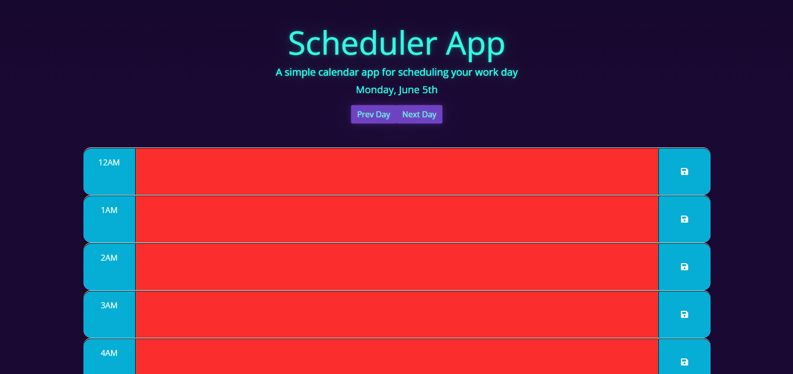
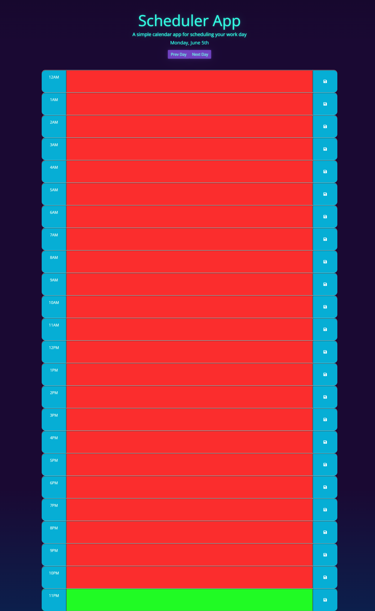

# Scheduler-App
## Description

I wanted to make a super useful and visually pleasing scheduler app. It has the ability to not only save input text on each hour of a 24 hour schedule, but also can save multiple different day's worth of data. I wanted to build a way to keep track of tasks and events happening in my personal and professional life. It allows me to easily see if a task is past-due, in the future, or if I should currently be working on it. Through doing this I learned a lot more about html manipulation through js and specifically through jquery, bootstrap, and the dayjs API.

## Table of Contents

- [Usage](#usage)
- [Credits](#credits)
- [License](#license)
- [Features](#features)

## Usage

Head on over here to check out the page ==> [Scheduler App](https://ikonicres.github.io/Scheduler-App/)    

The page is easy to use:  

It has a display of the current date at the bottom of the header below description and Title, and a pleasing color theme. The "Next Day" and "Prev Day" buttons change the current day the user is viewing to the previous or next day respectively, playing a nice animation to fade out the old one offscreen and fade the new one in from offscreen.  

  
The currently viewed day is displayed, from 12AM to 11PM. If the hour is in the future, the label will be blue. If its the current hour, the label will be green, and if its in the past, the label will be red. Type something in the textbox in the middle of an hour to add text to the scheduled time, but make sure to hit one of the save icon buttons to save the schedule. The schedule saves to local storage and should persist even if a new day's schedule is loaded, saving the schedule before traversal. It should also update the current hour automatically at the turn of the hour, and if the turn of the hour changes day, it will fire the animation that plays when changing days.   

  

## Credits

Woo coffee, music and much enthusiasm.

## License

The MIT License (MIT)

Copyright (c) 2023 Michael Ikonomou

Permission is hereby granted, free of charge, to any person obtaining a copy of this software and associated documentation files (the "Software"), to deal in the Software without restriction, including without limitation the rights to use, copy, modify, merge, publish, distribute, sublicense, and/or sell copies of the Software, and to permit persons to whom the Software is furnished to do so, subject to the following conditions:

The above copyright notice and this permission notice shall be included in all copies or substantial portions of the Software.

THE SOFTWARE IS PROVIDED "AS IS", WITHOUT WARRANTY OF ANY KIND, EXPRESS OR IMPLIED, INCLUDING BUT NOT LIMITED TO THE WARRANTIES OF MERCHANTABILITY, FITNESS FOR A PARTICULAR PURPOSE AND NONINFRINGEMENT. IN NO EVENT SHALL THE AUTHORS OR COPYRIGHT HOLDERS BE LIABLE FOR ANY CLAIM, DAMAGES OR OTHER LIABILITY, WHETHER IN AN ACTION OF CONTRACT, TORT OR OTHERWISE, ARISING FROM, OUT OF OR IN CONNECTION WITH THE SOFTWARE OR THE USE OR OTHER DEALINGS IN THE SOFTWARE.

## Features

-Saves complete schedule calendar and associated text to localstorage, persisting through reload etc.
-Automatically updates day at turn of the hour
-Has buttons to navigate the schedule's days, allowing user to see past and future day's tasks and schedules.
-Has cool theme and makes eyes happy
-Fully commented/cleaned and written in jQuery/bootstrap making it easy to read and modify
